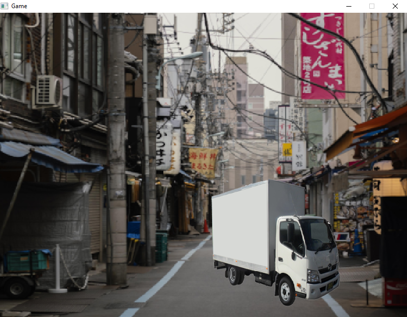

# Game

## Build and run
> make

## Game rules
The user controls a character trapped in the arena. Enemies of several types come endlessly (or in several waves) from outside the arena (at the discretion of the programmer) and attack the character. The player can shoot at them by aiming with the mouse, and move around to avoid damage. The field may contain shelters (at the discretion of the programmer). For each defeated opponent, the player is awarded points. As soon as the player loses all lives, or the opponents run out, the game ends and the number of points scored during the game is displayed on the screen. The top 10 results are stored in a file and displayed on the screen at the user's request.

## Screens

